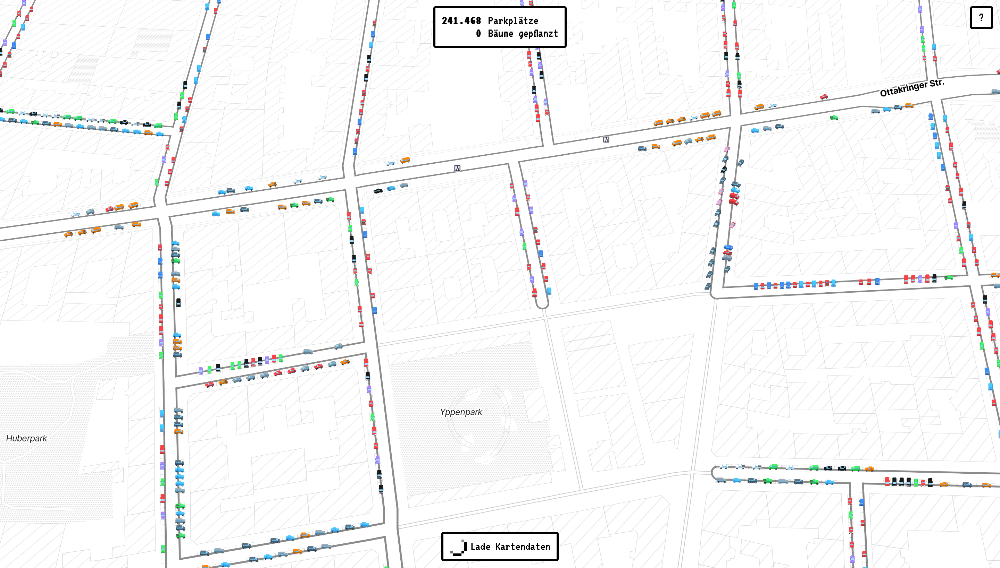

# Wiener Parkplätze

Berechnung und Visualisierung der einzelnen Straßenparkplätze im Wiener Stadtgebiet.

Datenbasis ist die Flächenmehrzweckkarte (FMZK) der Magistratsabteilung für Stadtvermessung MA 41.

Weitere Infos im [Blogeintrag](https://elias-gander.github.io/2025-3-11-wiener-parkplaetze).

[Demo](https://elias-gander.github.io/data-visualization/wiener-parkplaetze/)

## Setup

1. Repo clonen

2. Virtuelles Python-environment erstellen und aktivieren

   1. Im Terminal zum Root-Folders des Repos navigieren
   2. `python -m venv ./venv`
   3. `source venv/bin/activate`

3. Benötigte Python Packages installieren: `pip install -r requirements.txt`

4. Alle Zellen des Jupyter-Notebooks (_wiener_parkplaetze.ipynb_) ausführen (kann eine gute Stunde dauern!)

5. Interaktive Kartendarstellung starten

   1. Im Terminal in den _web_-Folder navigieren
   2. `python -m http.server`
   3. Im Browser zu _http://localhost:8000_ navigieren
